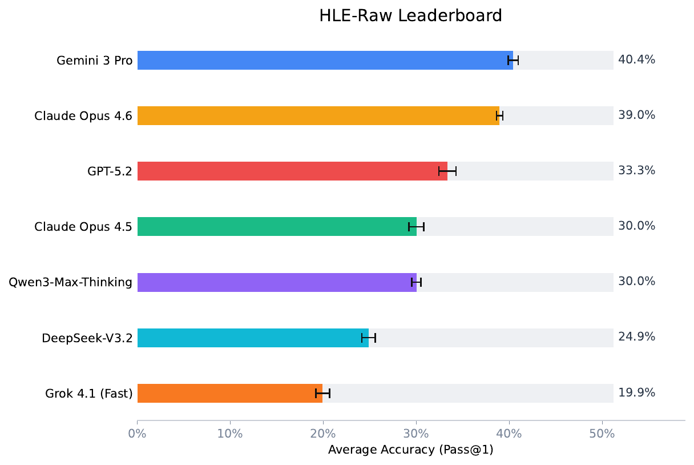
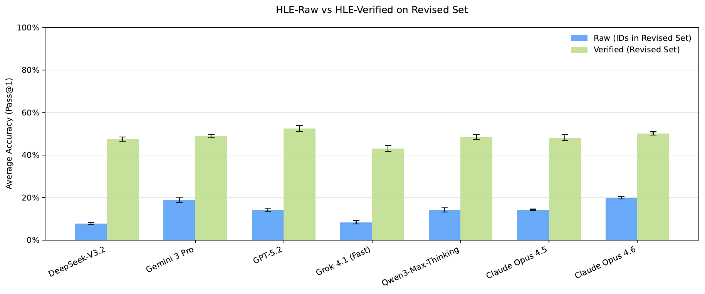

# HLE-Verified
A Systematic Verification and Structured Revision of Humanity’s Last Exam

## Overview

Humanity’s Last Exam (HLE) is a high-difficulty, multi-domain benchmark designed to evaluate advanced reasoning capabilities across diverse scientific and technical domains.

Following its public release, members of the open-source community raised concerns regarding the reliability of certain items. Community discussions and informal replication attempts suggested that some problems might contain:

- Incorrect final answers  
- Incomplete or internally inconsistent rationales  
- Ambiguous or underspecified problem statements  
- Format-induced semantic distortions  

These issues, while not universal, highlight structural risks inherent to high-difficulty benchmark construction. When left unaddressed, such defects may introduce unintended evaluation bias, distort model ranking comparisons, or reduce interpretability.


**HLE-Verified** is a systematically audited and reliability-enhanced version of the **Humanity’s Last Exam (HLE)** benchmark.

The dataset contains **2,500 items**, each verified through structured auditing and, where necessary, conservative revision.

Unlike traditional benchmark releases that treat each item as a monolithic unit, HLE-Verified introduces explicit verification metadata for the problem statement, reference rationale, and final answer, enabling transparent and reproducible reliability analysis.

This work does **not redefine HLE**.  
Instead, it provides a structured post-release verification and revision protocol to improve measurement reliability.

---

## Dataset Composition

The dataset is partitioned into three mutually exclusive subsets:

| Subset | Size | Description |
|--------|------|-------------|
| **Gold** | 641 | Fully validated, no modification required |
| **Revision** | 1,170 | Corrected under preserved evaluation objectives and re-verified |
| **Uncertain** | 689 | Validity cannot be conclusively determined under current evidence |

**Total: 2,500 items**

---

## Motivation

Humanity’s Last Exam (HLE) is a high-difficulty, multi-domain benchmark spanning:

- Math  
- Physics  
- Chemistry  
- Biology / Medicine  
- Computer Science/AI
- Engineering
- Humanities/Social Science
- Other

High-difficulty benchmarks carry structural risks:

- Incorrect problem statements may introduce systematic evaluation bias  
- Incorrect answer keys may distort model rankings  
- Non-verifiable rationales reduce interpretability  
- Ambiguous items may corrupt calibration and uncertainty analysis  

As benchmark difficulty increases, annotation integrity becomes critical.  
HLE-Verified addresses these risks through structured auditing and conservative adjudication.

---

## Verification Protocol

HLE-Verified follows a two-stage structured pipeline.

### Stage I — Model Replication and Diagnostic Analysis

- Standardized solver prompting  
- Structured answer extraction  
- Mathematical equivalence checking  
- pass@k replication statistics  

Model outputs serve as **diagnostic signals**, not as ground truth.

---

### Stage II — Structured Repair and Conservative Adjudication

- Historical solution extraction  
- Multi-model collaborative repair  
- Final adjudication  
- Post-repair cross-audit validation  

Decision principle:

If correctness cannot be confirmed with reasonable confidence, the item is marked as **Uncertain**.

---

## Data Schema

Each record contains both content fields and structured verification metadata.

```json
{
  "id": 1024,
  "question": "The original or revised question",
  "original_question": "[Optional] Present only if the question was revised.",
  "answer": "The original or revised final answer",
  "original_answer": "[Optional] Present only if the answer was revised.",
  "rationale": "The original or revised reasoning",
  "original_rationale": "[Optional] Present only if the rationale was revised.",
  "verify_meta_info": {
    "problem_verify": {
      "is_valid": 1,
      "error_type": null,
      "error_reason": null
    },
    "answer_verify": {
      "is_valid": 1,
      "error_type": null,
      "error_reason": null
    },
    "rationale_verify": {
      "is_valid": 1,
      "error_type": null,
      "error_reason": null
    }
  }
}
```

---
## Field Description

### Core Content Fields

- `id`  
  Unique item identifier.

- `question`  
  The final problem statement used for evaluation (original or revised).

- `original_question` *(optional)*  
  Present **only if** the problem statement was revised; stores the original HLE question.

- `answer`  
  The final answer used for evaluation (original or revised).

- `original_answer` *(optional)*  
  Present **only if** the answer was revised; stores the original HLE answer key.

- `rationale`  
  The final reference rationale/solution (original or revised).

- `original_rationale` *(optional)*  
  Present **only if** the rationale was revised; stores the original HLE rationale.

### Verification Metadata (`verify_meta_info`)

Verification is recorded for three components:

- `verify_meta_info.problem_verify`
- `verify_meta_info.answer_verify`
- `verify_meta_info.rationale_verify`

Each verification object contains:

- `is_valid`
  - `1` = valid
  - `0` = invalid
- `error_type` *(only if invalid)*  
  Integer defect category/type identifier.
- `error_reason` *(only if invalid)*  
  Short explanation describing why the component was judged invalid.

> **Note**  
> Items marked as **Uncertain** at the dataset level may still include partial verification signals.  
> When validity cannot be established under available evidence, the conservative decision is to retain the item in the **Uncertain** subset.

---

## Statistical Observations

Structured verification reveals systematic patterns:

- **Answer-related defects** are predominantly incorrect final answers.
- **Rationale issues** primarily involve missing prerequisites and structural incompleteness.
- **Format-induced semantic distortions** are more common in Computer Science and Chemistry.
- **Fully theoretical invalidity** is relatively rare.

These patterns indicate that HLE’s problematicness is **structured rather than random**.

---

## Leaderboard Comparison

### HLE-Verified Leaderboard


[Download Full PDF](leaderboard_HLE_Verified.pdf)

---

### HLE-Raw Leaderboard



[Download Full PDF](leaderboard_HLE_Raw_Text_Full.pdf)

---

### HLE-Raw vs HLE-Verified on Revised Set



[Download Full PDF](bars_raw_vs_verified_subset.pdf)

---

## Recommended Usage

- Use **Gold** subset for leaderboard-level or stability-sensitive evaluation.
- Use **Revision** subset for robustness testing and sensitivity analysis.
- Use **Uncertain** subset for ambiguity research and verification methodology studies.

When reporting results, clearly specify:

- which subset(s) were used
- whether original or verified answers were adopted

---

## Research Applications

HLE-Verified supports research in:

- Benchmark auditing and reliability analysis
- Chain-of-thought verification
- LLM-as-Judge evaluation
- Multi-model consensus-based repair
- Structured defect analysis
- Conservative decision mechanisms

---

## Limitations

- Model replication statistics are diagnostic signals, not ground truth.
- Expert adjudication reflects available domain expertise at the time of release.
- The Uncertain subset remains open for future refinement.
- Repairs preserve original evaluation objectives but may not exhaust all possible interpretations.

---

## Cite

If you use **HLE-Verified** in your research, please cite:

```bibtex
@techreport{hle_verified_2026,
  title        = {HLE-Verified: A Systematic Verification and Structured Revision of Humanity’s Last Exam},
  author       = {Alibaba Group, Data \& Qwen Team},
  institution  = {Technical Report},
  year         = {2026}
}
```
